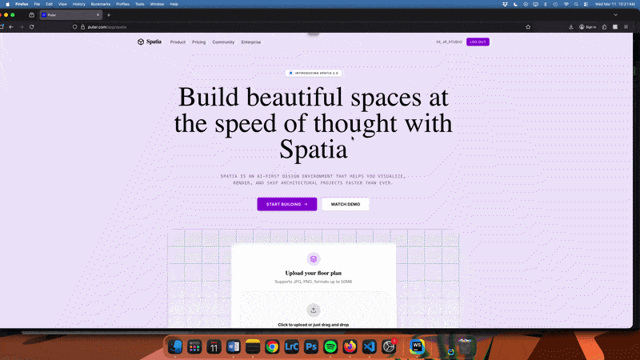

# 🏗️ Spatia


<h3 align="center">Spatia | AI-Powered Architectural Visualization Platform</h3>

An AI-powered architectural visualization platform that transforms **2D floor plans into photorealistic 3D renders** using modern AI models and serverless infrastructure.

Spatia allows architects, designers, and creators to quickly visualize architectural concepts, store their renders permanently, and share projects with a global community.

---

# 🎥 Demo

<p align="center">
  
</p>

---

# 📌 Problem

Architects and designers often rely on complex 3D modeling tools to visualize architectural concepts. These tools can require significant time, expertise, and computing resources.

Many early-stage projects begin as **simple 2D floor plans or sketches**, but converting these designs into realistic 3D visualizations typically involves multiple tools, manual modeling, and rendering pipelines.

The goal of this project was to build a **modern AI-powered platform that instantly transforms 2D architectural layouts into photorealistic 3D visualizations**, while also providing persistent hosting, project management, and a community discovery feed.

---

# ✅ Solution

Spatia is a **SaaS-style AI visualization platform** that allows users to upload architectural floor plans and generate photorealistic 3D renders using advanced AI models.

The platform integrates **serverless cloud workers, persistent file storage, and AI model APIs** to process user submissions and generate high-quality visualizations.

Users can store their generated renders permanently, organize projects in a personal gallery, and optionally share their work publicly through a global discovery feed.

The application focuses on **performance, scalability, and modern frontend architecture** while leveraging cloud infrastructure to handle AI generation and storage.

---

# 🧑‍💻 Technologies Used

- **React** – Frontend framework for building the user interface  
- **TypeScript** – Static typing for improved reliability and maintainability  
- **Vite** – Fast development server and optimized production builds  
- **Tailwind CSS** – Utility-first styling for rapid UI development  
- **Puter Cloud Platform** – Serverless infrastructure including Workers, storage, and KV database  
- **Puter.js** – JavaScript SDK for interacting with cloud services directly from the frontend  
- **Claude AI** – Used for AI-driven architectural transformation logic  
- **Gemini AI** – Used for image generation and visual interpretation  

---

# 🏗️ System Architecture

Spatia uses a modern serverless architecture that combines a React frontend with cloud-based AI processing and persistent storage.

User
 ↓
React Frontend
 ↓
Puter Serverless Workers
 ↓
AI Models (Claude / Gemini)
 ↓
Storage + KV Database
 ↓
Community Feed

### Architecture Overview

1. **Frontend (React + TypeScript)**  
   The client application handles user interactions, project management, and visualization UI.

2. **AI Processing Layer**  
   Floor plan images are sent to AI models (Claude and Gemini) for architectural interpretation and photorealistic render generation.

3. **Serverless Workers (Puter)**  
   Workers process requests, manage AI interactions, and coordinate file storage operations.

4. **Persistent Storage**  
   Uploaded floor plans and generated renders are stored permanently with public URLs.

5. **KV Database**  
   Project metadata, ownership, and visibility settings are stored in a high-performance key-value database.

6. **Community Feed System**  
   Public projects are indexed and displayed in the global discovery feed.

---  

# 🔥 Key Features

## 2D-to-3D Visualization

Transforms flat architectural floor plans into **photorealistic 3D renders** using modern AI models.

---

## Persistent Media Hosting

All generated renders and uploads are stored with **permanent URLs**, allowing projects to be accessed and shared at any time.

---

## Dynamic Project Gallery

Users can view their complete **history of architectural visualizations**, including project metadata and generated renders.

---

## Side-by-Side Comparison

Spatia allows users to view **original floor plans alongside AI-generated renders**, making transformations easy to visualize.

---

## Global Community Feed

Users can publish projects to a **public community feed**, enabling discovery and inspiration across the platform.

---

## Privacy Controls

Each project includes **public/private visibility controls**, allowing users to manage how their architectural data is shared.

---

## Ownership Mapping

A metadata system tracks **project ownership, user IDs, and project details** across the platform.

---

## Export Tools

Generated renders can be **downloaded and exported** for use in presentations, design workflows, or client reviews.

---

# 🧠 Technical Decisions

### Why Puter?

Puter provides a **serverless cloud platform** with built-in storage, compute workers, and hosted AI models. This allows Spatia to offload heavy AI processing and storage to the cloud while keeping the frontend lightweight.

---

### Why TypeScript?

TypeScript improves code reliability by introducing **static typing**, which helps prevent runtime errors and improves maintainability as the project grows.

---

### Why Serverless Workers?

Serverless workers enable **scalable AI processing** without maintaining traditional backend servers, allowing image generation and data storage to scale automatically.

---

### Why React + Vite?

React provides a component-based architecture for building complex UI interactions, while Vite offers **fast development builds and optimized production performance**.

---

# 📦 Core Application Modules

### Visualization System

- AI render generation
- 2D floor plan analysis
- Photorealistic 3D visualization

---

### Project Management

- User project gallery
- Metadata tracking
- Persistent render storage

---

### Community Platform

- Global discovery feed
- Public project sharing
- Privacy and visibility controls

---

# 🎯 Key Learnings

Through building Spatia I:

- Integrated **AI model APIs for architectural visualization**
- Built a **SaaS-style architecture using serverless cloud infrastructure**
- Implemented **persistent storage and metadata tracking**
- Developed **scalable AI processing workflows**
- Built a **modern React + TypeScript frontend architecture**
- Implemented **cloud storage and global project sharing**

---

## ⚙️ Engineering Challenges

One major challenge was handling AI-generated media while keeping the frontend performant. Since generated renders can be large, the system uses persistent cloud storage and metadata tracking to avoid repeatedly transferring large files.

This allows renders to be stored once while being referenced efficiently across the project gallery and community feed.

---

# 🚀 Running the Project Locally

Clone the repository

```bash
git clone https://github.com/yourusername/spatia.git

- Navigate into the project
cd spatia

- Install dependencies
npm install

- Start the development server
npm run dev

- The application will run at:
http://localhost:5173